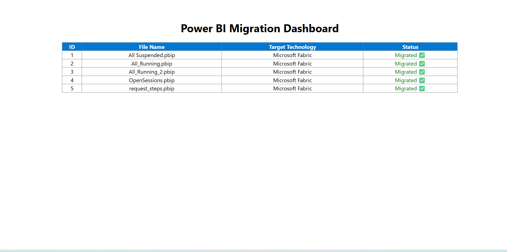

# Power BI Migration Project

This project automates the migration of Power BI (.pbip) files.

## 📊 Dashboard Preview

## 🚀 Tasks Completed
- **Task 1:** Find and replace server and database name in PBIP files.
- **Task 2:** Invoke Python migration scripts from the Node.js backend.
- **Task 3:** Logic to change technology in connection (Databricks to Microsoft Fabric Lakehouse).
- **Task 4:** Show all migration metadata in a React UI dashboard.

## 🛠️ How to Run
1. **Backend:** Run `node server.js`
2. **Frontend:** Run `cd migration-ui` then `npm start`